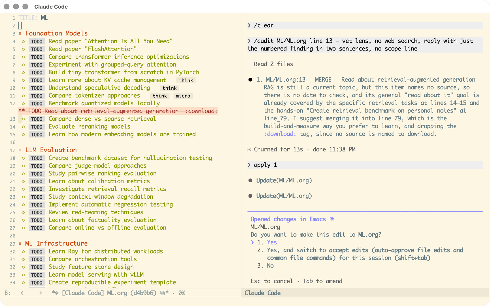
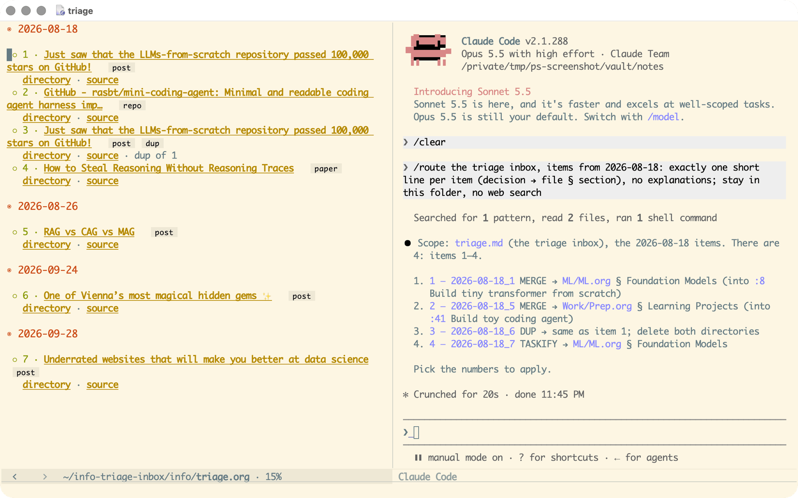
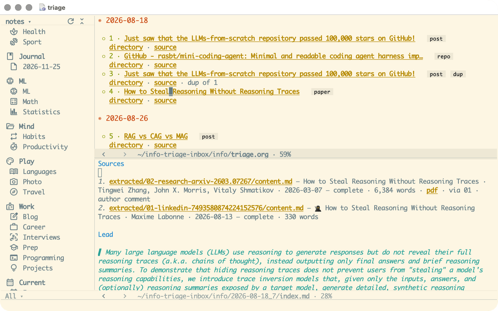
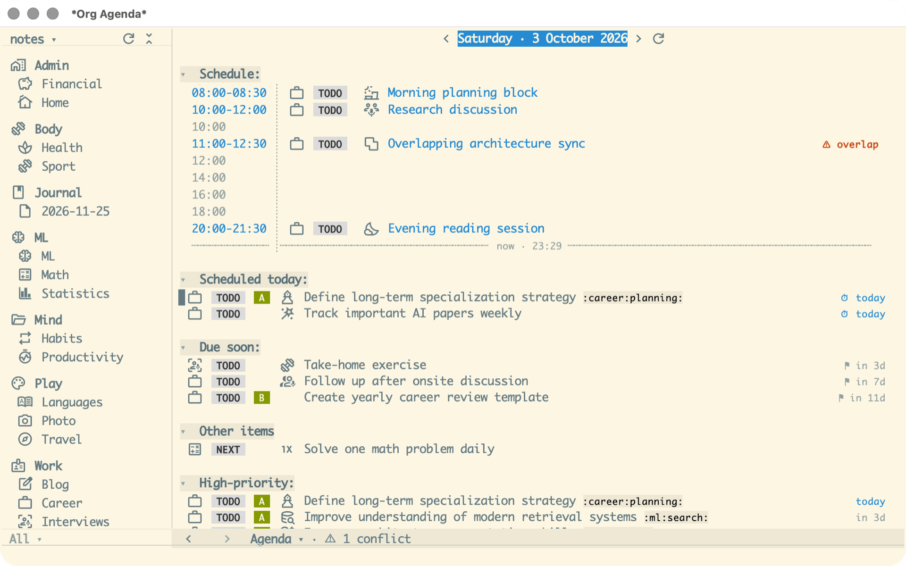
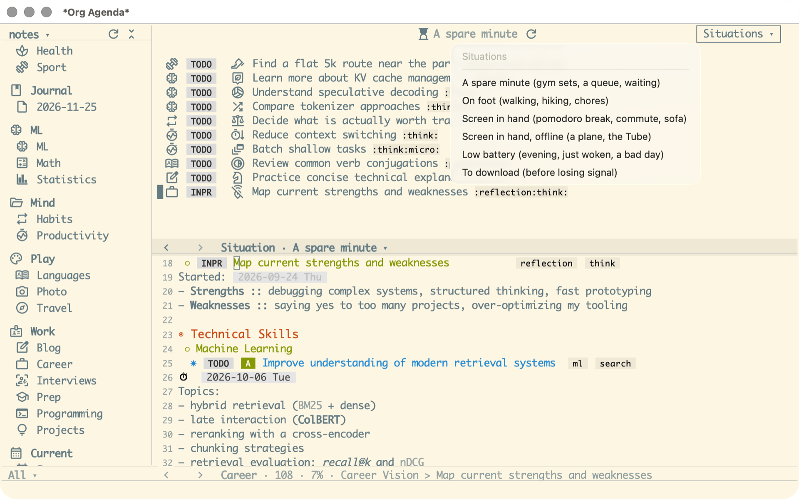
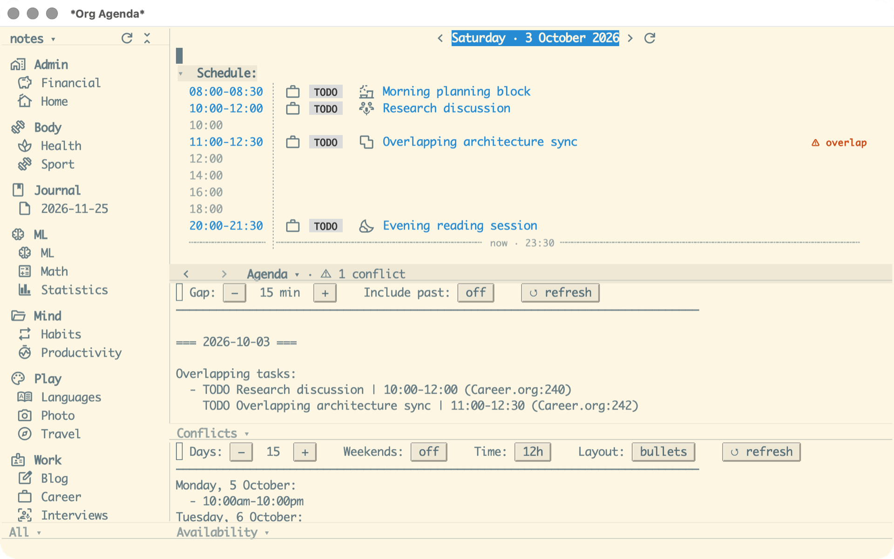
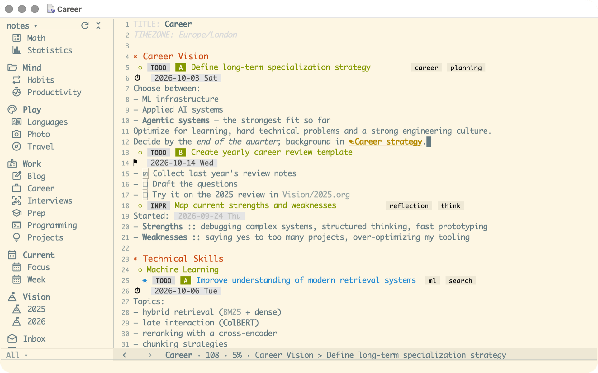
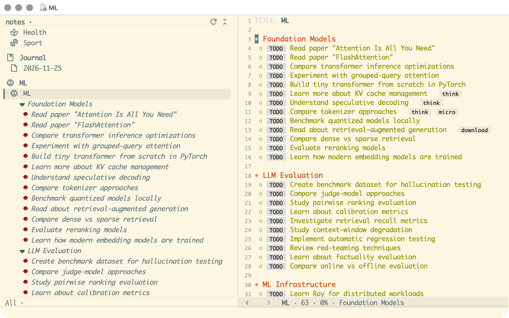
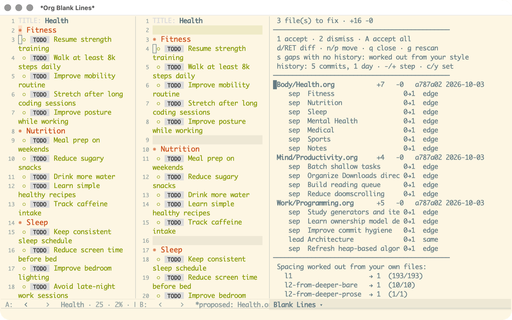

# Agentic Org Planner

[](https://github.com/anton-dergunov/agentic-org-planner/actions/workflows/tests.yml)

Planning in plain-text [Org Mode](https://orgmode.org/) files, with a coding agent as a working
participant: you talk to Claude Code about your plans, it reads and edits the same files you do,
and every change it proposes reaches you as a diff to accept or reject. Around it is a complete
Emacs configuration built for planning, so the editor looks like a modern tool from the first
launch instead of like the 1980s.

<p align="center">
  
</p>

The assistant needs a Claude subscription; everything else works without it. The configuration
doubles as a complete `~/.emacs.d`, so you can use it whole or borrow pieces of it.

## Planning with an agent

- **It works on your files, under review.** Claude Code runs in a side panel and knows which
  file you are in and what you have selected, so "this" means what you are looking at. The
  changes it proposes open as Emacs diffs that you step through and accept or reject.
- **It knows how your plan works.** Built-in rules say what "task", "project" and "note" mean in
  your files and what a well-shaped task looks like. Your TODO states, priorities, tags and saved
  searches are passed on from the configuration, so it follows your conventions instead of
  guessing them. An `AGENTS.md` in your Org folder adds what is personal to you, such as where
  your reference notes live; plans link into an Obsidian vault for those.
- **Two skills keep the plans in shape.** `/audit` reviews a plan file for outdated material,
  vague tasks and things in the wrong place. `/route` takes captured material, from an inbox
  file, the capture inbox or text pasted into the chat, and works out for each item whether it
  is worth keeping, whether you already have it, how to phrase it as a task and where it
  belongs. Both report numbered findings and change nothing until you pick which to apply.



- **It files what you captured.** The articles, papers and posts you forward to yourself during
  the day arrive as a numbered queue, prepared by the separate
  [agent-context-pipeline](https://github.com/anton-dergunov/agent-context-pipeline) project:
  links resolved, the content extracted, related notes looked up. You read it in Emacs, drop
  what is not worth keeping, and hand the rest to `/route`, which sees the same numbers.



See [AI integration](docs/AI-integration.org) and [Info triage](docs/Info-triage.org) for how
to set it up and steer it.

## Seeing your plan

- **The agenda**: your day at a glance. A real timeline of today's events with a now-line, then
  what is scheduled, due soon, high-priority and in progress, with an icon for what each task is
  about and compact pills for its state, priority and date.



- **The calendar**: what is happening over a stretch of time, a day, a week, a month or a year,
  with nothing but dates and times in it. See [the Calendar](docs/Calendar.org).
- **The tasks view**: every open task in one list, to slice down by state and tag. See
  [the Tasks view](docs/Tasks-view.org).
- **Situations**: saved searches named by circumstance ("a spare minute", "on foot", "screen in
  hand, offline"), so an awkward gap in the day has an answer ready instead of turning into a
  scroll. Pick one from a menu, and open any task in it to see its notes.



- **Planning tools**: free slots across the coming days, overlapping events, and shifting
  timestamps between time zones.



## An Emacs that looks and works right

Making Emacs look and behave the way you want is slow work: a long tail of defaults to change,
quirks to work around and small things that break each other, before the editor stops getting in
the way. This configuration has done that work for planning, so it starts out as a calm,
readable place to plan in rather than a project of its own.

Org files are plain text, but they don't have to look like it. Headings, TODO states, priorities
and tags render as clean badges and pills; bold, italic, code and links render without their
markup, which comes back only while you edit it; checklists, dates and deadlines get icons;
finished tasks fade. Plan files can be set in a proportional font and a centred reading column.



The file tree shows your Org areas with icons, and a plan file opens out into its sections and
tasks, so it doubles as an outline of what is in each file. Several Org folders, called
**vaults**, can be kept and switched between from the tree, each with its own icons, saved
searches and Git remote.



Many smaller fixes add up: a quiet mode line built for planning, an auto-hiding scroll indicator
with smooth scrolling, headlines that wrap without breaking their tag pills, multilingual typo
checking that flags only what is likely wrong, and themes you can audition live (see the
[gallery](docs/Customization.org)).

## Tools

- **Blank-line recovery.** Mobile Org apps such as Beorg and Orgzly throw away the blank lines
  you put between sections. One command puts them back from your Git history, shows you what
  it would restore and why, and saves only what you accept, never changing a character of your
  text.



- **Background Git sync** of your Org folder, with its state in the mode line, and a one-time
  setup that keeps a Dropbox folder and Git from corrupting each other.

## Quick start

> Full, per-OS instructions are in [docs/Installation.org](docs/Installation.org).

1. Install [Emacs](https://www.gnu.org/software/emacs/download.html) (29+) and
   [ripgrep](https://github.com/BurntSushi/ripgrep) (used for searching). On
   macOS, read [the note below](#macos-build-emacs-with-the-freeze-fix) first.
2. Clone this repo as your Emacs config directory:
   ```bash
   git clone https://github.com/anton-dergunov/agentic-org-planner.git ~/.emacs.d
   ```
   (On Windows this is usually `C:\Users\<USER>\AppData\Roaming\.emacs.d`.)
3. Start Emacs. Packages download on first launch, then it offers to create a
   **vault** — the folder your Org files live in. To explore first, open the
   bundled `samples/realistic/` example instead.
4. Press **`C-c p a`** to open the agenda.

For the prettiest result, also install the **Material Symbols** icon font — see
[docs/Installation.org](docs/Installation.org).

### macOS: build Emacs with the freeze fix

On macOS, stock Emacs 30 can freeze outright — the window stops accepting input
and only Force Quit gets you out — and this config's background Git sync makes
it likely. The bug is in Emacs itself; two patches in [`patches/`](patches/) fix
it, and [emacs-plus](https://github.com/d12frosted/homebrew-emacs-plus) builds
Emacs with them applied. The recipe, and a check that the fix is in, are in
[docs/Installation.org](docs/Installation.org).

## Documentation

Start here: **[docs/Index.org](docs/Index.org)** — a guided table of contents.

Jump straight to:

- [Installation](docs/Installation.org) — set it up on macOS, Linux, or Windows
- [Emacs basics](docs/Emacs-basics.org) — new to Emacs? essential editing and
  navigation keys
- [Planning setup](docs/Planning-setup.org) — your Org files, task states, and
  the keys for editing tasks
- [The Agenda](docs/Agenda.org) — the heart of the system
- [Situations](docs/Situations.org) — context tags and the saved searches over
  them
- [Vaults](docs/Vaults.org) — several Org folders, switching between them, and
  which settings belong to which
- [Customization & appearance](docs/Customization.org) — themes, fonts, icons,
  and settings
- [AI integration (Claude Code)](docs/AI-integration.org) — the optional
  assistant and how to guide it with `AGENTS.md`
- [Keybindings](docs/Keybindings.org) — every shortcut on one page
- [Dropbox & Git together](docs/Dropbox-and-git.org) — keeping your notes in a
  cloud folder *and* in Git: the one setup step that stops the two from
  corrupting each other

## Developing

Run Emacs straight from this repo (no install), run the tests, and extend it
with new modules — see [docs/Developing.org](docs/Developing.org). The
screenshots above are retaken by hand from the shot list in
[`screenshots/README.md`](screenshots/README.md).
